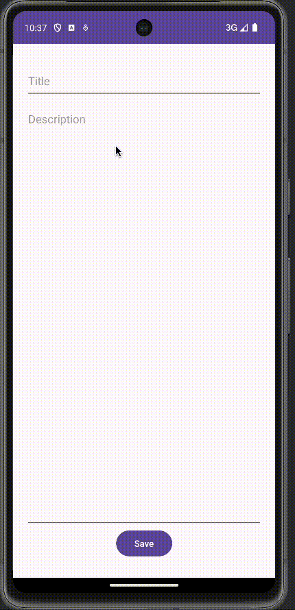

# Notes App

User has ability to perform CRUD operations on notes.

## Functionality 

The following **required** functionality is completed:

* [ ] User sees screen with all of their notes, along with a button to add a new note
* [ ] User can click on their notes to edit them, or add a new note

The following **extensions** are implemented:

* Room Library (SQLite)
* Live Data
* Navigation

## Video Walkthrough

## Notes

Getting the Room Library properly setup was challenging at first. 

## License

    Copyright [2023] [Alex LaPointe]

    Licensed under the Apache License, Version 2.0 (the "License");
    you may not use this file except in compliance with the License.
    You may obtain a copy of the License at

        http://www.apache.org/licenses/LICENSE-2.0

    Unless required by applicable law or agreed to in writing, software
    distributed under the License is distributed on an "AS IS" BASIS,
    WITHOUT WARRANTIES OR CONDITIONS OF ANY KIND, either express or implied.
    See the License for the specific language governing permissions and
    limitations under the License.
